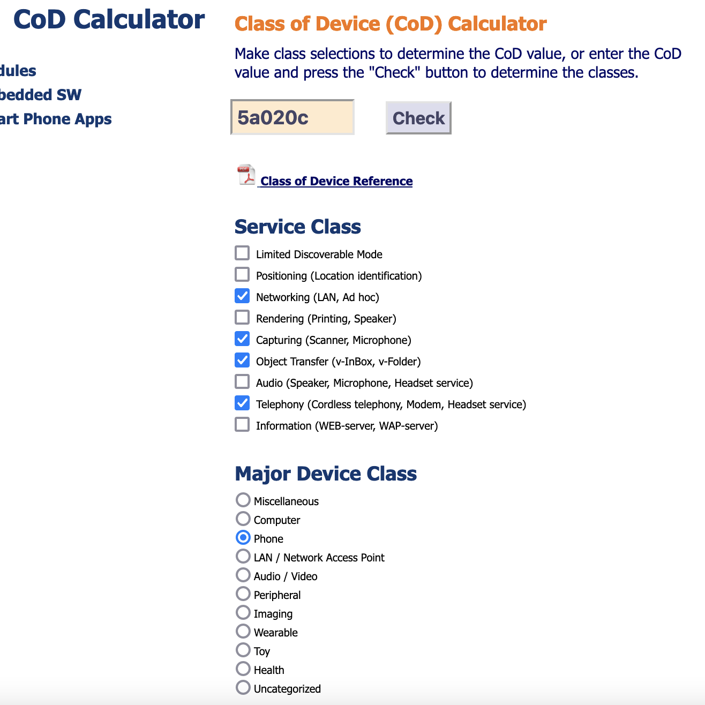

# Bluey

Bluetooth-related challenges.

Before you start:

```bash
# install bluetooth tools on Linux
$ sudo apt update
$ sudo apt install -y bluetooth bluez bluez-tools rfkill

# ensure your user is added to the 'lp' group to allow pairing
$ sudo usermod -aG lp $USER
$ sudo newgrp lp

# make sure you have a bluetooth device available on your computer
$ hcitool dev
Devices:
	hci1	B8:27:EB:76:11:25

# if necessary, restart bluetooth service
$ service bluetooth restart
$ service dbus restart

# disable/enable bluetooth device
$ hciconfig hci0 down
$ hciconfig hci0 up

# check that bluetooth isn't blocked by rfkill
$ sudo rfkill
$ sudo rfkill unblock bluetooth

# scan for bluetooth LE devices (find desired MAC, or name if lucky)
$ sudo hcitool lescan
LE Scan ...
   00:19:5D:37:FD:EA OroJackson
--- snip ---
```

## May I Speak to the Manager? - 15

What is the LMP version in use by the CTF Device?

```bash
$ sudo hcitool lescan
LE Scan ...
   00:19:5D:37:FD:EA OroJackson
--- snip ---

$ hcitool info 00:19:5D:37:FD:EA
Requesting information ...
  BD Address:  00:19:5D:37:FD:EA
  OUI Company: ShenZhen XinHuaTong Opto Electronics Co.,Ltd (00-19-5D)
  Device Name: OroJackson
  LMP Version: 4.1 (0x7) LMP Subversion: 0x2209   # <== THIS
  Manufacturer: Broadcom Corporation (15)
  Features page 0: 0xbf 0xfe 0xcf 0xfe 0xdb 0xff 0x7b 0x87
    <3-slot packets> <5-slot packets> <encryption> <slot offset>
    <timing accuracy> <role switch> <sniff mode> <RSSI>
    <channel quality> <SCO link> <HV2 packets> <HV3 packets>
    <u-law log> <A-law log> <CVSD> <paging scheme> <power control>
    <transparent SCO> <broadcast encrypt> <EDR ACL 2 Mbps>
    <EDR ACL 3 Mbps> <enhanced iscan> <interlaced iscan>
    <interlaced pscan> <inquiry with RSSI> <extended SCO>
    <EV4 packets> <EV5 packets> <AFH cap. perip.>
    <AFH cls. perip.> <LE support> <3-slot EDR ACL>
    <5-slot EDR ACL> <sniff subrating> <pause encryption>
    <AFH cap. central> <AFH cls. central> <EDR eSCO 2 Mbps>
    <EDR eSCO 3 Mbps> <3-slot EDR eSCO> <extended inquiry>
    <LE and BR/EDR> <simple pairing> <encapsulated PDU>
    <err. data report> <non-flush flag> <LSTO> <inquiry TX power>
    <EPC> <extended features>
  Features page 1: 0x0a 0x00 0x00 0x00 0x00 0x00 0x00 0x00
  Features page 2: 0x13 0x03 0x00 0x00 0x00 0x00 0x00 0x00
```

LMP Version: `4.1`


## Did you do your homework? - 15

BT devices will be assigned a "Class of device" to let other devices know what type of device they are communicating with. What is the class of device for the CTF Device?

```bash
# Inquire about device classes
$ hcitool inq
Inquiring ...
  F8:4D:89:79:F2:5A clock offset: 0x68f0  class: 0x280104
  00:19:5D:37:FD:EA clock offset: 0x6a7c  class: 0x5a020c # <== THIS ONE
  --- snip ---
```

To translate the class of device, use this webpage:
- [Class of Device (CoD) Calculator](https://www.ampedrftech.com/cod.htm)



Class of Device: `Phone`


## Yu Yu Identifier - 15

Bluetooth services will always come with a UUID (Universally Unique Identifier) to let other devices know what they’re supposed to do. What is the UUID of the custom Bluetooth Service?

```bash
$ sdptool browse 00:19:5D:37:FD:EA
Browsing 00:19:5D:37:FD:EA ...
 Service Search failed: Invalid argument
 Service Name: Moby_Dick     # <== Custom Service name
 Service Description: The first key is hidden in another service on this machine! Search the sdp server for the service with the RecHandle 0x80108. The key is the value of Attribute Identifier 2022. Do you know how to browse Attribute Identifiers?
 Service Provider: The pairing PIN is the inverse of the last 2 bytes of the BT Address! Btw heres another flag: Suzumebachi   # <== Flag
 Service RecHandle: 0x10006
 Service Class ID List:
   UUID 128: 88888888-1111-0000-1111-888888888888  # <== UUID
   "Serial Port" (0x1101)
 Protocol Descriptor List:
   "L2CAP" (0x0100)
   "RFCOMM" (0x0003)
     Channel: 26     # <== RFCOMM Channel
 Profile Descriptor List:
   "Serial Port" (0x1101)
     Version: 0x0100
```

UUID: `88888888-1111-0000-1111-888888888888`


## This remote is broken… - 15

What RFCOMM Channel is the custom Bluetooth Service using?

See previous challenge output for solution steps.

RFCOMM Channel: `26`


## This wasn’t in the manual… - 20

The CTF Device is hosting a custom Bluetooth Service. What is the name of this service?

See [Yu Yu Identifier](#Yu%20Yu%20Identifier%20-%2015) challenge output for solution steps.

Service Name: `Moby_Dick`


## Address - 25

What is the Bluetooth Address of the CTF Device?

```bash
$ sudo hcitool lescan
LE Scan ...
   00:19:5D:37:FD:EA OroJackson
--- snip ---
```

BT Address: `00:19:5D:37:FD:EA`


## Lays or Pringles? - 25

Who is the chip manufacturer of the Bluetooth chip on the CTF Device?

```bash
$ hcitool info 00:19:5D:37:FD:EA
Requesting information ...
  BD Address:  00:19:5D:37:FD:EA
  OUI Company: ShenZhen XinHuaTong Opto Electronics Co.,Ltd (00-19-5D)
  Device Name: OroJackson
  LMP Version: 4.1 (0x7) LMP Subversion: 0x2209
  Manufacturer: Broadcom Corporation (15)   # <== Chip Manufacturer
  Features page 0: 0xbf 0xfe 0xcf 0xfe 0xdb 0xff 0x7b 0x87
    <3-slot packets> <5-slot packets> <encryption> <slot offset>
    <timing accuracy> <role switch> <sniff mode> <RSSI>
    <channel quality> <SCO link> <HV2 packets> <HV3 packets>
    <u-law log> <A-law log> <CVSD> <paging scheme> <power control>
    <transparent SCO> <broadcast encrypt> <EDR ACL 2 Mbps>
    <EDR ACL 3 Mbps> <enhanced iscan> <interlaced iscan>
    <interlaced pscan> <inquiry with RSSI> <extended SCO>
    <EV4 packets> <EV5 packets> <AFH cap. perip.>
    <AFH cls. perip.> <LE support> <3-slot EDR ACL>
    <5-slot EDR ACL> <sniff subrating> <pause encryption>
    <AFH cap. central> <AFH cls. central> <EDR eSCO 2 Mbps>
    <EDR eSCO 3 Mbps> <3-slot EDR eSCO> <extended inquiry>
    <LE and BR/EDR> <simple pairing> <encapsulated PDU>
    <err. data report> <non-flush flag> <LSTO> <inquiry TX power>
    <EPC> <extended features>
  Features page 1: 0x0a 0x00 0x00 0x00 0x00 0x00 0x00 0x00
  Features page 2: 0x13 0x03 0x00 0x00 0x00 0x00 0x00 0x00
```

Chip Manufacturer: `Broadcom`


## Name - 25

What is the name of the CTF Device?

```bash
$ sudo hcitool lescan
LE Scan ...
   00:19:5D:37:FD:EA OroJackson
--- snip ---
```

Device name: `OroJackson`


## Walmart or Costco? - 25

Who is the OUI of the CTF Device?

```bash
$ hcitool info 00:19:5D:37:FD:EA
Requesting information ...
  BD Address:  00:19:5D:37:FD:EA
  OUI Company: ShenZhen XinHuaTong Opto Electronics Co.,Ltd (00-19-5D) # <== THIS
  Device Name: OroJackson
  LMP Version: 4.1 (0x7) LMP Subversion: 0x2209
  Manufacturer: Broadcom Corporation (15)
  Features page 0: 0xbf 0xfe 0xcf 0xfe 0xdb 0xff 0x7b 0x87
    <3-slot packets> <5-slot packets> <encryption> <slot offset>
    <timing accuracy> <role switch> <sniff mode> <RSSI>
    <channel quality> <SCO link> <HV2 packets> <HV3 packets>
    <u-law log> <A-law log> <CVSD> <paging scheme> <power control>
    <transparent SCO> <broadcast encrypt> <EDR ACL 2 Mbps>
    <EDR ACL 3 Mbps> <enhanced iscan> <interlaced iscan>
    <interlaced pscan> <inquiry with RSSI> <extended SCO>
    <EV4 packets> <EV5 packets> <AFH cap. perip.>
    <AFH cls. perip.> <LE support> <3-slot EDR ACL>
    <5-slot EDR ACL> <sniff subrating> <pause encryption>
    <AFH cap. central> <AFH cls. central> <EDR eSCO 2 Mbps>
    <EDR eSCO 3 Mbps> <3-slot EDR eSCO> <extended inquiry>
    <LE and BR/EDR> <simple pairing> <encapsulated PDU>
    <err. data report> <non-flush flag> <LSTO> <inquiry TX power>
    <EPC> <extended features>
  Features page 1: 0x0a 0x00 0x00 0x00 0x00 0x00 0x00 0x00
  Features page 2: 0x13 0x03 0x00 0x00 0x00 0x00 0x00 0x00
```

OUI: `ShenZen`


## Secret Flag - 25

It’s right there

```bash
$ sdptool browse 00:19:5D:37:FD:EA
Browsing 00:19:5D:37:FD:EA ...
 Service Search failed: Invalid argument
 Service Name: Moby_Dick
 Service Description: The first key is hidden in another service on this machine! Search the sdp server for the service with the RecHandle 0x80108. The key is the value of Attribute Identifier 2022. Do you know how to browse Attribute Identifiers?
 Service Provider: The pairing PIN is the inverse of the last 2 bytes of the BT Address! Btw heres another flag: Suzumebachi   # <== Flag
 Service RecHandle: 0x10006
 Service Class ID List:
   UUID 128: 88888888-1111-0000-1111-888888888888
   "Serial Port" (0x1101)
 Protocol Descriptor List:
   "L2CAP" (0x0100)
   "RFCOMM" (0x0003)
     Channel: 26
 Profile Descriptor List:
   "Serial Port" (0x1101)
     Version: 0x0100
```

Secret Flag: `Suzumebachi`


## Secret Key 1 - 25

Hidden in the information you’ve looked through to answer the challenges so far is one of the last two keys! You need the first one to get the second one.

The hint from the Moby_Dick service's description says:
```
The first key is hidden in another service on this machine! Search the sdp server for the service with the RecHandle 0x80108. The key is the value of Attribute Identifier 2022. Do you know how to browse Attribute Identifiers?
```

So we need to look for the service with RecHandle `0x80108`:
```bash
$ sdptool browse --tree 00:19:5D:37:FD:EA
Browsing 00:19:5D:37:FD:EA ...
--- snip ---
 Attribute Identifier : 0x0 - ServiceRecordHandle
   Integer : 0x80108  # <== Matching RecHandle
 Attribute Identifier : 0x1 - ServiceClassIDList
   Data Sequence
     UUID16 : 0x1106 - OBEXFileTransfer
 Attribute Identifier : 0x4 - ProtocolDescriptorList
   Data Sequence
     Data Sequence
       UUID16 : 0x0100 - L2CAP
     Data Sequence
       UUID16 : 0x0003 - RFCOMM
       Channel/Port (Integer) : 0xa
     Data Sequence
       UUID16 : 0x0008 - OBEX
 Attribute Identifier : 0x5 - BrowseGroupList
   Data Sequence
     UUID16 : 0x1002 - PublicBrowseGroup
 Attribute Identifier : 0x9 - BluetoothProfileDescriptorList
   Data Sequence
     Data Sequence
       UUID16 : 0x1106 - OBEXFileTransfer
       Version (Integer) : 0x100
 Attribute Identifier : 0x100
   Data : 4f 42 45 58 20 46 69 6c 65 20 54 72 61 6e 73 66 65 72 00
 Attribute Identifier : 0x2022  # <== Matching Attribute ID
   Data : 47 75 6e 67 6e 69 72 00  # <== hex-encoded key
--- snip ---
```

So the key is `47 75 6e 67 6e 69 72 00`, which is a hex-encoded string. To decode it, you can use [CyberChef](https://cyberchef.org/#recipe=From_Hex('Auto')To_Hexdump(16,false,false,false)&input=NDcgNzUgNmUgNjcgNmUgNjkgNzIgMDA) or the command line:

```bash
$ echo "47 75 6e 67 6e 69 72 00" | xxd -r -p
Gungnir
```

Secret Key: `Gungnir`


## This is side one, flip me over - 30

What is the Record Handle for the Bluetooth Service you were asked to look through for a hint?

```bash
$ sdptool browse 00:19:5D:37:FD:EA
Browsing 00:19:5D:37:FD:EA ...
 Service Search failed: Invalid argument
 Service Name: Moby_Dick
 Service Description: The first key is hidden in another service on this machine! Search the sdp server for the service with the RecHandle 0x80108. The key is the value of Attribute Identifier 2022. Do you know how to browse Attribute Identifiers?
 Service Provider: The pairing PIN is the inverse of the last 2 bytes of the BT Address! Btw heres another flag: Suzumebachi
 Service RecHandle: 0x10006  # <== Service Record Handle
 Service Class ID List:
   UUID 128: 88888888-1111-0000-1111-888888888888
   "Serial Port" (0x1101)
 Protocol Descriptor List:
   "L2CAP" (0x0100)
   "RFCOMM" (0x0003)
     Channel: 26
 Profile Descriptor List:
   "Serial Port" (0x1101)
     Version: 0x0100
```

Service Record Handle: `0x10006`


## Do you like pears or apples better? - 30

This device uses a fixed PIN code to pair with devices! That is an incredibly insecure way to configure a device, but I did it anyway! What is that PIN?

From the hint in the output of the previous command (Service Provider field):

```
The pairing PIN is the inverse of the last 2 bytes of the BT Address!
```

The BT Address is `00:19:5D:37:FD:EA`, so the last two bytes are `FD:EA`. Inverting the bits and printing the resulting hex, we get the following:

```bash
$ python -c 'print(f"{(~0xFDEA) & 0xFFFF:04x}")'
0215

# To pair to the CTF device (not required to solve challenge)
$ sudo bluetoothctl
[bluetooth]> scan  # put nearby devices into bluetoothctl database
[bluetooth]> pair 00:19:5D:37:FD:EA  # enter PIN when prompted
# optionally, trust the device for easier furture connections
[bluetooth]> trust 00:19:5D:37:FD:EA

# maybe try this to pair with pin?
# http://www.heatxsink.com/entry/how-to-pair-a-bluetooth-device-from-command-line-on-linux
# rfcomm connect /dev/rfcomm0 00:11:22:33:44:55 1 &

# Additionally, it is good practice to enable secure simple pairing and enable page and inquiry scan with the following commands:
# hciconfig hci0 sspmode 1
# hciconfig hci0 piscan
```

Pairing pin: `0215`


## Secret Key 2 - 150

Well done, you’ve found the first key! Now use it to unlock the second key.

```bash
# first install the necessary python library to interact with bluetooth
$ pip install PyBluez
```

Then create the following file to send the data to the appropriate service.

`getkey2.py`:
```python
import bluetooth

btsock = bluetooth.BluetoothSocket( bluetooth.RFCOMM )
btsock.connect(("00:19:5D:37:FD:EA", 26))
btsock.send(b"Gungnir\x00")
print(btsock.recv(2049))
btsock.close()
```

Run the script, and it will spit out a message with the key.

